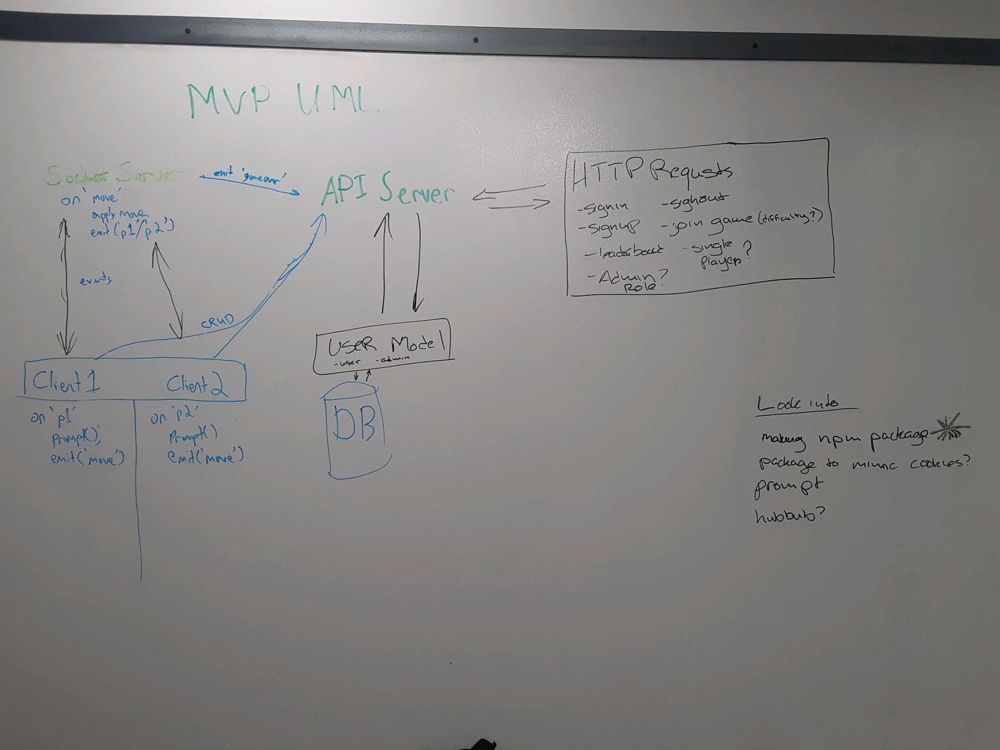

# 401 Midterm - Nimble

## API Server

#### Authors: Becky, Chris, Joé, Morgana

## Links & Resources
* [GitHub Repo](https://github.com/401-advanced-javascript-nimble/API_server)
* [Heroku Deployment](https://nimble-api-server.herokuapp.com/)
* [Travis]( --- )

### Documentation

### Modules
* `index.js` -- Initializes mongoose and starts the server.
* `src/app.js` -- Uses express to set server configuration and expose routes.
* `src/models/users.js` -- Defines the database schema and holds methods for users
* `src/router/router.js` -- Defines the routes available on the server and applies authorization middleware where needed.
* `src/authorization/authorization.js` -- Checks Basic and Bearer auth and validates user tokens.
* `src/middleware/error_handler.js` -- Controls behaviour on server errors.
* `src/middleware/404.js` -- Controls behaviour on non-existant routes.

### Setup
#### `.env` Requirements
* SECRET -- token generation
* MONGODB_URI -- database location
* TOKEN_EXPIRATION_TIME -- token lifetime
* PORT -- port to use (when running locally)

### Running the App
* `POST /signup` -- Add a user to the database.  If the user's role is a superuser, they will be provided a key, otherwise the user will receive a token.  Requires: username, password, email
Optional: role
* `POST /signin` -- Passes through auth middleware to verify username and password, and provides a new token if successful.
Requires: username, password
* `GET /leaderboard`
* `PUT /socket` -- Used for the socket server/client to send updates after a game to be saved to the database.
Requires: stats: {wins}
* `GET /admin`

### Operating Instructions
* This RESTful API server runs live at https://nimble-api-server.herokuapp.com/. Perform the above requests to interact with this API. 

#### Tests
* How do you run tests?
* What assertions were made?
* What assertions need to be / should be made?

#### UML
